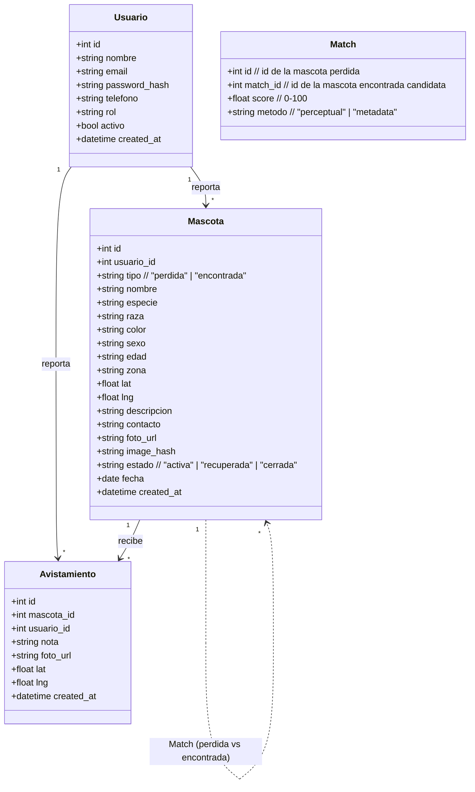
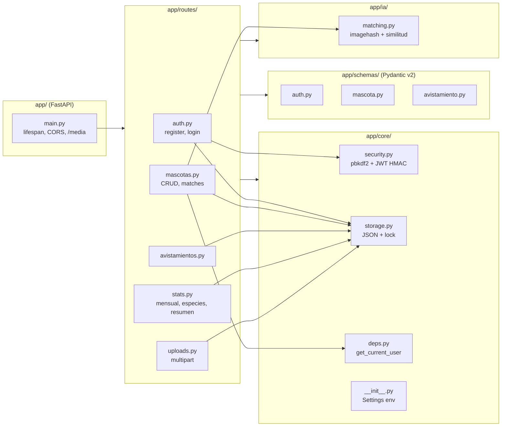
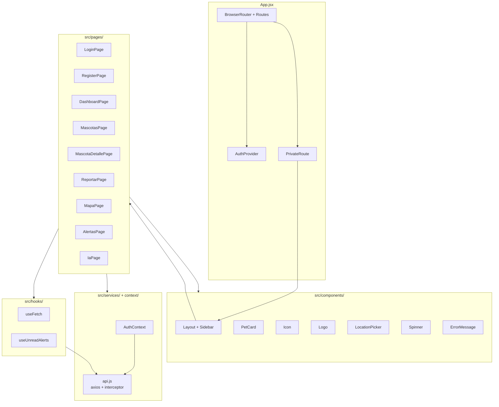
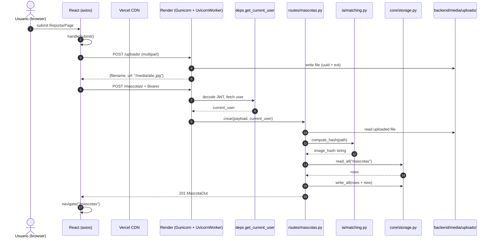
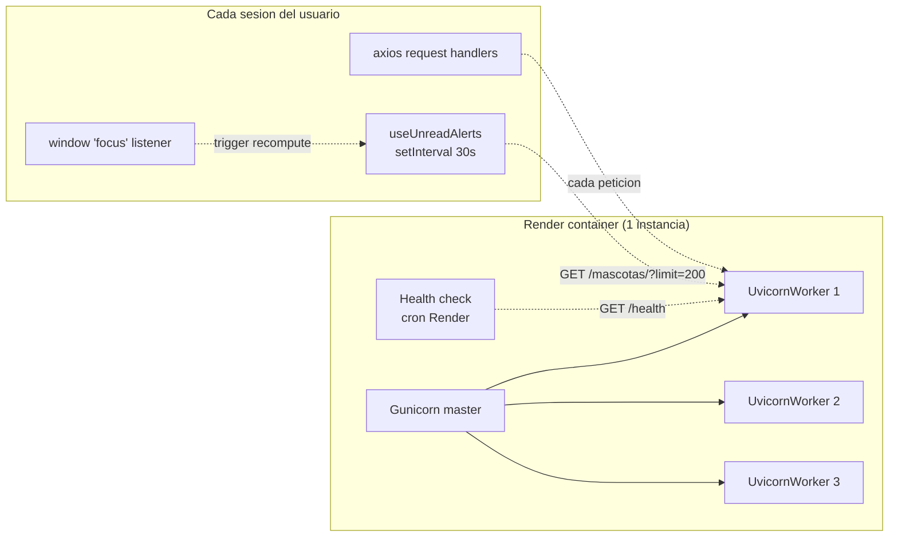
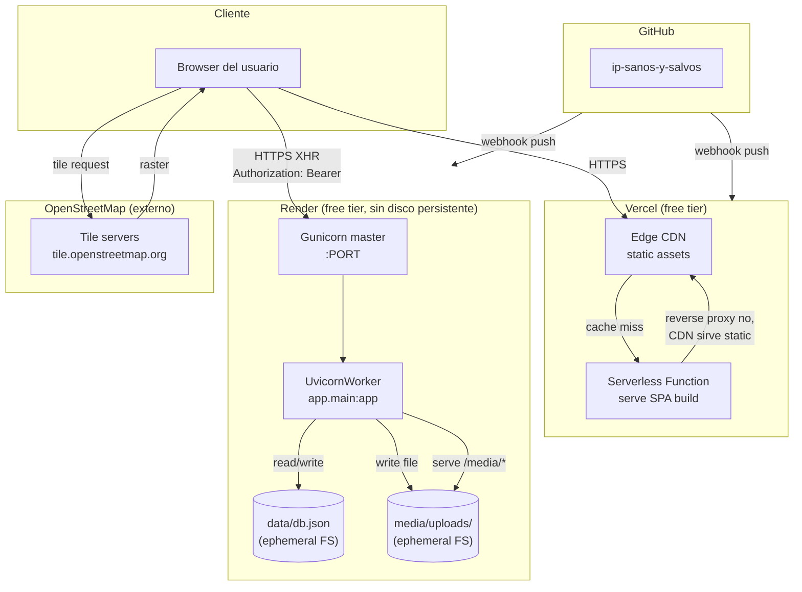
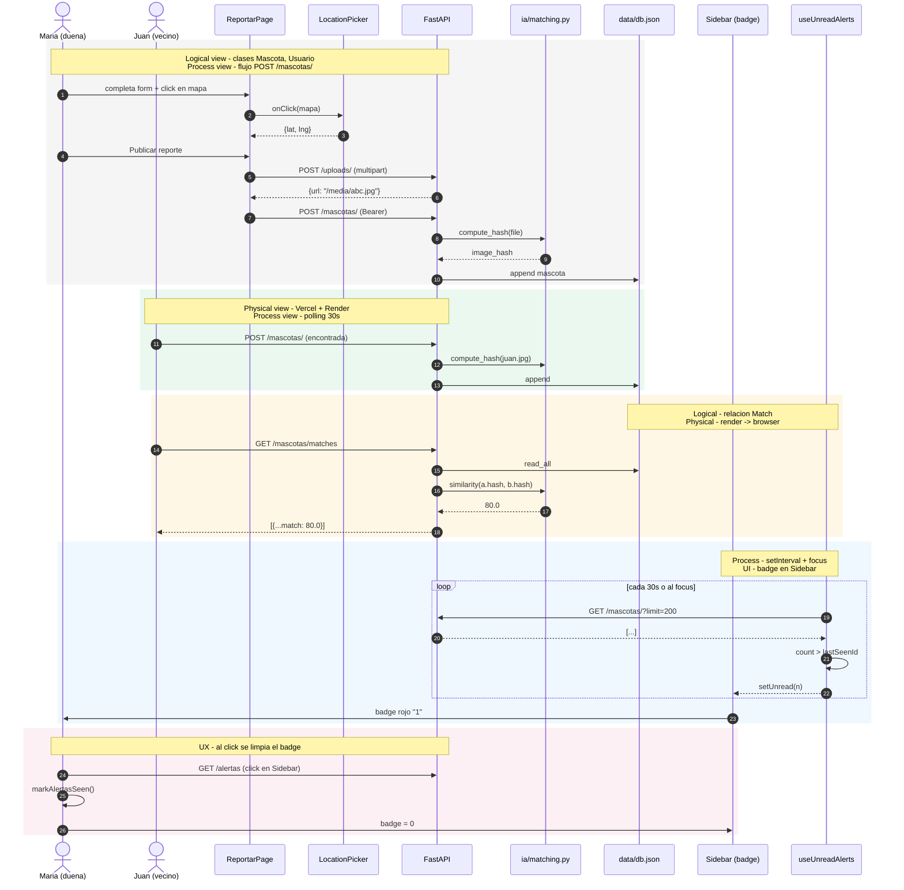

# Vista 4+1 de la arquitectura

Documento de arquitectura de **Sanos y Salvos MVP** siguiendo el
modelo 4+1 de Kruchten (1995). Cubre 4 vistas + 1 escenario que las
ata. Pensado para revisores académicos y para onboarding de
contribuidores.

Los diagramas están escritos en **Mermaid** y se renderizan
directamente en GitHub, VS Code, Obsidian y la mayoría de visores
de Markdown.

---

## Indice

1. [Vista Logica](#1-vista-logica) - modelo de objetos y paquetes
2. [Vista de Procesos](#2-vista-de-procesos) - flujo runtime
3. [Vista Fisica](#3-vista-fisica) - nodos y red
4. [Vista de Escenarios (+1)](#4-vista-de-escenarios-1) - caso de uso que ata todo
5. [Decisiones arquitectonicas](#5-decisiones-arquitectonicas) - ADRs cortos
6. [Limitaciones conocidas](#6-limitaciones-conocidas) - deuda tecnica explicita

---

## 1. Vista Logica

**Proposito:** modelar el dominio (Usuario / Mascota / Avistamiento)
y la estructura de paquetes tanto del backend como del frontend, sin
preocuparse de donde corren.

### 1.1 Modelo de dominio

Nota: `Match` no se persiste. Se calcula en runtime cruzando
`Mascota` activas de tipo opuesto (ver `routes/mascotas.py:get_matches`).

### 1.2 Paquetes del backend

### 1.3 Paquetes del frontend

---

## 2. Vista de Procesos

**Proposito:** mostrar el flujo runtime de un request HTTP tipico y
los procesos concurrentes que sostienen el servicio. Refleja las
decisiones de Gunicorn workers, polling del badge, y el
hashing perceptual lazy en el endpoint POST.

### 2.1 Request flow: crear mascota con foto

### 2.2 Procesos concurrentes

**Notas de proceso:**

- Gunicorn arranca N workers (1 por CPU core en free tier = 1).
- `UvicornWorker` permite async handlers (FastAPI/Starlette).
- El health check de Render corre cada ~30s y se mantiene trivial
  (ver `main.py:GET /health`) para no tocar disco ni BD.
- El polling del badge en el frontend es un **setInterval 30s** que
  se dispara tambien al recibir `window.focus` (cambio de tab del
  browser).
- El **auto-seed** corre en el `lifespan` de FastAPI al primer
  arranque si la BD esta vacia. Es idempotente, no bloquea el
  arranque si falla.

---

## 3. Vista Fisica

**Proposito:** modelar los nodos reales, donde corre cada artefacto
y como se conectan. Refleja el deploy actual en Vercel + Render
free tier.

### 3.1 Topologia de deploy

### 3.2 Artefactos

| Artefacto                      | Donde vive                   | Como se construye                         | Persistencia                                              |
| ------------------------------ | ---------------------------- | ----------------------------------------- | --------------------------------------------------------- |
| `frontend/build/` (CRA static) | Vercel CDN                   | `npm run build` en cada push a `main`     | Cache CDN permanente                                      |
| `backend/app/` (codigo)        | Render container             | `pip install -r requirements.txt`         | Imagen inmutable del deploy                               |
| `data/db.json`                 | Render container FS          | Generado por `seed.py` en primer arranque | **Ephemeral**: sobrevive sleep/wake, se borra en redeploy |
| `media/uploads/*.jpg`          | Render container FS          | Generado por `POST /uploads/`             | **Ephemeral**                                             |
| `seed_assets/*.jpg`            | Render container FS (bundle) | Empaquetado con el codigo                 | Persiste con el codigo (read-only en runtime)             |
| `static.json` (Tailwind)       | Vercel CDN                   | Incluido en `public/index.html`           | Cache CDN                                                 |

### 3.3 URLs de referencia

| Servicio | URL (referencia)                  | Lectura                      |
| -------- | --------------------------------- | ---------------------------- |
| UI       | `https://<proyecto>.vercel.app`   | https://vercel.com/dashboard |
| API      | `https://<proyecto>.onrender.com` | https://dashboard.render.com |

---

## 4. Vista de Escenarios (+1)

**Proposito:** anclar las 4 vistas en un caso de uso real que
recorre el sistema entero. Este escenario muestra como las piezas
se conectan cuando un duenio reporta, la IA encuentra un match, y
otro usuario ve la notificacion.

### Escenario: "Dueño reporta mascota, IA encuentra match, comunidad lo ve"

**Que vistas se ejercitan en este escenario:**

| Vista           | Lo que demuestra                                                               |
| --------------- | ------------------------------------------------------------------------------ |
| Logica          | Entidades `Usuario`, `Mascota`, relacion `Match`                               |
| Procesos        | 4 requests secuenciales + polling concurrente                                  |
| Fisica          | Vercel sirve el bundle, Render ejecuta Gunicorn, BD ephemeral, OSM sirve tiles |
| Escenarios (+1) | El loop cerrado: crear -> match -> notificar -> leer                           |

---

## 5. Decisiones arquitectonicas

ADRs cortos que justifican las elecciones no obvias.

### ADR-001: Persistencia en JSON, no SQL

- **Contexto:** MVP academico de 2-3 meses. Tabla pequena (~3 entidades), trafico bajo.
- **Decision:** un unico `data/db.json` con lock por thread.
- **Consecuencias:** cero infra externa, deploy trivial, facil de inspeccionar.
- **Trade-off:** no escala, no soporta concurrencia real (lock = serial).
- **Salida:** cuando se justifique, migrar a Postgres sin cambiar la API (ver `routes/mascotas.py` y `core/storage.py` como unica fuente de acceso a datos).

### ADR-002: JWT firmado a mano, sin libreria externa

- **Contexto:** se necesita autenticacion stateless pero la libreria `pyjwt` agrega una dependencia.
- **Decision:** implementar `create_access_token` / `verify_token` con `hmac` + `hashlib` stdlib en `core/security.py`.
- **Consecuencias:** zero deps extra, control total del formato. Mismo formato que un JWT real (header.payload.signature base64url).
- **Trade-off:** no hay validacion automatica de estandares. No soporta `kid`/JWKS.

### ADR-003: Matching perceptual con `imagehash`, no CNN

- **Contexto:** necesito comparar imagenes para encontrar mascotas perdidas.
- **Decision:** perceptual hash (8x8 average_hash) + distancia de Hamming.
- **Consecuencias:** rapido, sin GPU, sin modelo que mantener. ~0.1 ms por hash.
- **Trade-off:** sensible a cambios fuertes (rotacion, crop agresivo). Documentado en `ia/matching.py`.
- **Salida:** embeddings (CLIP, EfficientNet) cuando se justifique precision.

### ADR-004: Frontend en Vercel, backend en Render

- **Contexto:** deploy economico, sin tarjeta.
- **Decision:** Vercel (static + edge) para SPA, Render free tier (Gunicorn) para FastAPI.
- **Consecuencias:** $0/mes. Sin disco persistente en backend.
- **Trade-off:** los datos y fotos se pierden en redeploy. La app es demo, no produccion real.
- **Salida:** Render Starter ($7/mes) o Railway ($5 gratis) si se necesita persistencia.

### ADR-005: Tokens HMAC y CORS permisivo en dev

- **Contexto:** CORS `allow_origins=["*"]` en dev esta bien, en prod hay que restringir.
- **Decision:** env var `ALLOWED_ORIGINS` leida en `core/__init__.py:cors_origins`. Default `*` (dev). En prod se setea a la URL de Vercel.
- **Consecuencias:** configurar CORS en el dashboard de Render antes de produccion.

---

## 6. Limitaciones conocidas

Deuda tecnica explicita que el README heredo y este documento
formaliza.

| #   | Limitacion                                                                            | Impacto                                                                  | Cuando arreglarla                                    |
| --- | ------------------------------------------------------------------------------------- | ------------------------------------------------------------------------ | ---------------------------------------------------- |
| 1   | `GET /auth/me` no implementado                                                        | El frontend lo llama pero falla silencioso; localStorage cubre la sesion | Cuando se agregue logout multi-tab o revocar tokens  |
| 2   | Disco efimero en Render                                                               | Datos y fotos se pierden en redeploy                                     | Migrar a Render Starter o Railway                    |
| 3   | CORS `*` por default                                                                  | Si nadie configura `ALLOWED_ORIGINS` en prod, todos los origenes pasan   | Forzar en deploy via `render.yaml`                   |
| 4   | `data/db.json` lock por thread                                                        | Bajo trafico OK, no escala a multiples procesos                          | Migrar a Postgres cuando crezca                      |
| 5   | `imagehash.average_hash` no invariante a rotacion                                     | Match cae drasticamente con fotos rotadas                                | Migrar a `phash` o CNN                               |
| 6   | Health check de Render cada 30s                                                       | Ruido en logs, no es un problema de carga                                | Filtrar en dashboard de Render                       |
| 7   | Tailwind via CDN                                                                      | No se tree-shake, pesa mas que la build local                            | Migrar a PostCSS cuando crezca                       |
| 8   | Sin tests automatizados                                                               | Decidido por el dueno para mantener velocidad del MVP                    | Cuando se estabilice la API                          |
| 9   | Bug pre-existente en seed: mascotas con nombre "Sin nombre" se skipean la segunda vez | El seed no crea todos los demos esperados                                | Refactor a identificadores unicos en lugar de nombre |

---

## Referencias

- Kruchten, P. (1995). "Architectural Blueprints - The 4+1 View Model of Software Architecture". IEEE Software 12(6).
- AGENTS.md - reglas de operacion del proyecto.
- README.md - setup, endpoints, demo accounts.
- DEPLOY.md - paso a paso de deploy en Vercel y Render.
